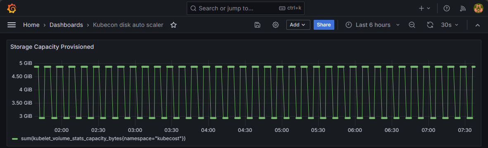

# Demo of disk-auto-scaler

The files in this directory create an automated demo that scales down a 3gb PVC to 1gb and recreates it.

This was mostly for a "kiosk mode" demo, but the examples can be applied to other use cases.

For automated continuous-scaling, see the [main readme](../README.md).

## Setup

It should just work by appling all files in this directory:

```sh
kubectl apply -f ./demo
```



Prometheus query to get the total capacity of the volumes in the kubecost namespace:

```
sum(kubelet_volume_stats_capacity_bytes{namespace="kubecost"})
```
